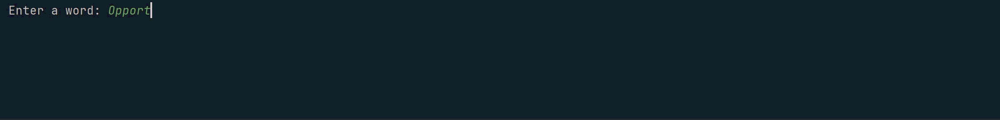

<h1>Day 26 of the 100 Days of Code: The Complete Python Pro Bootcamp</h1>

For the Day 26 challenge, I created a system that takes in a word and convert it to a list of words based on NATO phonetic alphabet, so that one can clearly spell out words to another, alphabet by alphabet. This is a culmination of the teaching points that were shared in the tutorial, including the following but not limited to

<ul>
  <li>List Comprehension</li>
  <li>Dictionary Comprehension</li>
  <li>Pandas, Dataframe and CSV</li>
  <li>Conditional Statements: If and While Loops</li>
</ul>

> [!TIP]
> List and dictionary comprehension can help to simplify codes related to conditional statements, allowing one to optimise their code! I found it incredibly helpful to first write down the conditional statements first like how I normally would, visualising it and then simplifying it into a line of code. 

  

<h2>Why am I doing this?</h2>

I have learned python before in school but I hope to revisit some of the python concepts that I may have forgotten and at the same time delve further into python, especially in the field of data science and visualisation.

<h2>You can join me too!</h2>

 Check out the 100 Days of Code: The Complete Python Pro Bootcamp udemy course through this <a href="https://www.udemy.com/course/100-days-of-code/">link</a>.

